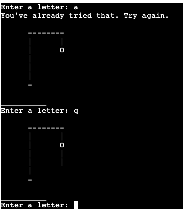

# Hangman Game - Python

## Introduction

For the 3rd Project of the Code Institute Course, I decided to make an Interactive Hangman Game where the User has to guess letters of a random word to try to win the game.

Hangman Game is a Single Player Game where a randomly generated word will be selected by the Computer and the User has limited tries to try and guess the Correct Word. Wether the Letter is correct or not, the User will receive real-time feedback.

Please find the live project [here:]() 

## Table Of Contents

+ [UX](#ux "UX")
  + [User Stories](#userstories "User Stories")
    + [As a player:](#first-time-user "As a player")
+ [Features](#features "Features")  
  + [Introduction](#Introduction "Introduction")
  + [Instructions](#Instructions "Instructions") 
  + [Start Game](#Start-Game "Start Game")
  + [Play Game](#Start-Game "Play Game")
+ [Future Features](#future-features "Future Features") 
+ [External Sources Used](#external-sources-used "External Sources Used")  
+ [Python Libraries Used](#python-libraries-used "Python Libraries Used")  
+ [Testing](#testing "Testing")
+ [Bugs and Solutions](#bugs-and-solutions "Bugs and Solutions")
+ [Development and Deployment](#development-and-deployment "Development and Deployment")
+ [Credits](#Credits "Credits")

## UX:
### User Stories
#### As a User/Player

- I want to play the game easily and stress free
- I want to be able to get real time feedback of my attempts   
#### As a player 

## Existing Features:

### Introduction
Once the Game starts, the user is presented with the 1st Stage of the Hangman Figure and will be asked to pick/type a letter.
 

### Instructions
User will be asked to type a Letter to try to guess the Word. If the letter is part of the word then the letter show as deisplayed here:
 

But if the Letter is wrong then it will go to the next stage of the Hangman Figure:
 

### Quit
Once the game is over either by loss or win. The game automatically quits.

[Back to top](#table-of-contents)

## Future Features
- Generate even more words rather than selecting a random word from the List we generated.
- Create International Versions of Hangman e.g. Japan

## Technology Used

 - [Python](https://www.python.org/)
 - [JavaScript](https://www.javascript.com/) provided in the Code Institute Template
 - [CSS](https://en.wikipedia.org/wiki/CSS)  provided in the Code Institute Template
 - [HTML](https://en.wikipedia.org/wiki/HTML)  provided in the Code Institute Template
## External Sources Used

- Stack Overflow
- W3 School
- Youtube
- [Blog Tutorial](https://www.pythonforbeginners.com/code-snippets-source-code/game-hangman#htoc-python-code-for-hangman-game)
- [Blog](https://inventwithpython.com/invent4thed/chapter8.html)
- [Am I Responsive](https://ui.dev/amiresponsive)

## Python Libraries Used
- [Random](https://www.w3schools.com/python/module_random.asp)
- [Random](https://docs.python.org/3/library/random.html)  for computer random moves

## Testing

Testing was conducted very carefully through the entire project. Since Pep8 does not seem to exist anymore online. I had to use an alternative i.e. ExtendsClass. And that came back positive with no errors.
[ExtendsClass](https://extendsclass.com/python-tester.html)

### Exception/Error testing:

- User's input was tested with all possible inputs. Empty spaces, numbers and or special characters are not accepted.

- If a User enters anything that is not a Letter, this will show:

- If the User enters an Incorrect Letter, the Hangman Figure will advance:

- If the User enters an Incorrect Letter, the Hangman Figure will advance:

- Python Pylint Report:

## Bugs and Solutions
No Bugs were made and or appeared during the production of this project.

## Development and Deployment

This project was developed with Visual Studio Code, using the template provided by Code Institute. Every step was documented and pushed thoroughly via GitHub.

The deployment is made using [Heroku](https://www.heroku.com/) following the listed steps:

1. Log in or register a new account on Heroku
2. Click on 'New' in the dashboard and select 'Create New App'
3. Select a name for the app and choose your region.
4. Click on "Create app"
4. When the app is created click on Setting 
5. To improve compatibility with various Python libraries add  Config Var with Key = PORT and the Value = 8000 
5. Add 2 buildpack: Python & Node (in that exact order)
6. Go back at the top and click on "Deploy" and select "GitHub"
7. Scroll down and click on 'Connect to GitHub'
8. Search for your GitHub repository name by typing it 
9. Click on "Connect"
10. Scroll down and click on "Deploy Branch"
11. You will see a message "The app was successfully deployed" when the app is built with python and all the depencencies
12. Click on view and you will see the [deployed site](https://python-hangman-game-ci-d7f106746402.herokuapp.com/)

## Credits

- A huge thanks goes to my mentor Jubril Akolade. who guided me with clear directions to finish the challenge.

[Back to top](#table-of-contents)
